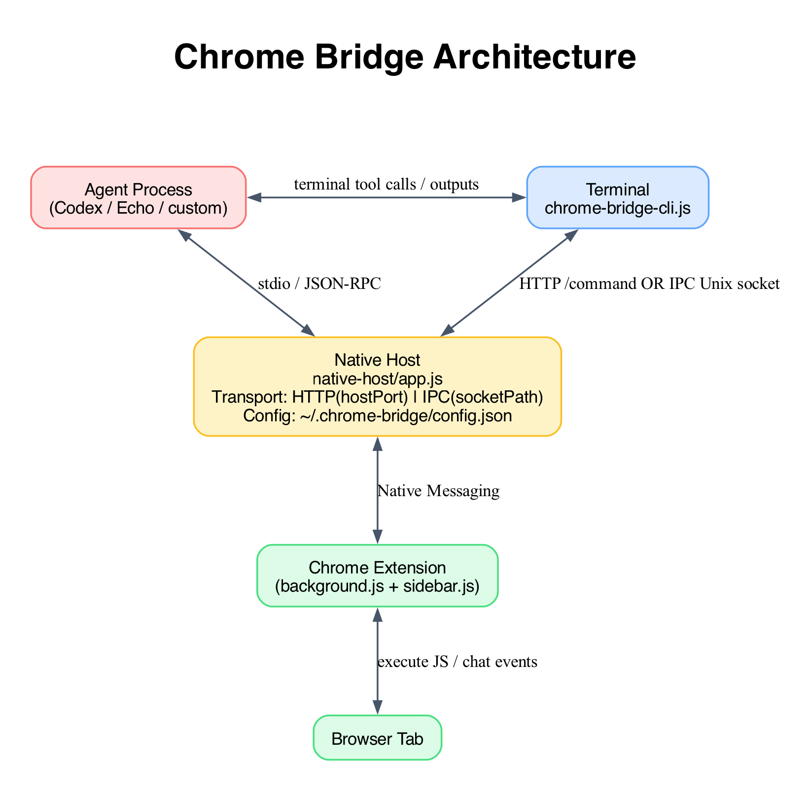

# Chrome Bridge

Chrome extension + native host bridge for:
- running JavaScript on browser tabs from terminal commands
- opening an in-page chat sidebar (from the extension icon) and relaying chat with native-host managed agents

## Recommended Interaction Model

- Primary path: interact through the in-page chat sidebar and a user-configured agent.
- Native host is usually driven by agent chat messages from the extension.
- CLI/scripts are still available, but mostly for debugging, diagnostics, and manual operations.

## How It Works

1. `chrome-bridge-cli/scripts/chrome-bridge-cli.sh` sends requests to `chrome-bridge-setup/native-host/app.js` over HTTP (`127.0.0.1:3456`).
2. `chrome-bridge-setup/native-host/app.js` forwards tasks through Chrome Native Messaging.
3. `chrome-bridge-setup/chrome-bridge-extension/backgroud.js` executes JavaScript in tabs and returns results.
4. Clicking the extension icon injects `chrome-bridge-setup/chrome-bridge-extension/sidebar.js`, which opens a floating chat panel overlay.
5. Chat messages are relayed through native messaging; native host spawns and manages one agent session per tab.

Native host name: `chrome_bridge`

## Diagrams

Graphviz source files:

- `diagrams/architecture.dot`

Render PNG output:

```bash
./diagrams/render-diagrams.sh
```

Generated output is written to `diagrams/`.

### Architecture Diagram



## Project Layout

- `skills/chrome-bridge-setup/` - setup skill with extension, native host, and installer.
- `skills/chrome-bridge-cli/` - CLI skill with command and helper scripts.
- `diagrams/` - Graphviz source diagrams and rendered outputs.
- `diagrams/render-diagrams.sh` - diagram render helper.
- `skills/chrome-bridge-setup/SKILL.md` - setup-skill specific docs.
- `skills/chrome-bridge-cli/SKILL.md` - cli-skill specific docs.

## Invocation Convention

Command examples below are skill-local (portable) paths:

- run setup commands from `skills/chrome-bridge-setup`
- run CLI commands from `skills/chrome-bridge-cli`

If you run from monorepo root, prefix with the skill path (for example `./skills/chrome-bridge-cli/scripts/...`).

## Chat Sidebar

- Click the extension icon on a normal web page to toggle the sidebar.
- Layout: floating overlay panel (draggable + resizable), without forcing page reflow.
- Header includes a settings button that opens the settings view.
- Settings supports multiple agent configs. Only one config can be active at a time.
- Per-agent actions include `Activate`, `Edit`, and `Delete`.
- Use `New` (top-right in settings) to add a config.
- Native host currently keeps one spawned chat process per tab.
- Chat commands:
  - `/page <instruction>`: injects current tab context (tab id/url/title) and asks agent to act on that tab.
  - `/help`: shows available chat commands.
  - Command implementation lives in `chrome-bridge-extension/commands/` (`index.js`, `help.js`, `page.js`).
- Auto mode:
  - On the first non-command chat message in a tab, extension auto-binds `/page` context for that tab.
  - After auto-bind, follow-up messages in the same tab keep using that page context until chat is closed.
- Runtime config:
  - `chrome-bridge-extension/runtime-config.js` controls pluggable defaults (`defaultAgentId`, `autoContextEnabled`, `autoContextCommand`) so background logic does not hardcode command/agent names.

## Agent Configuration

Agent specs are sent from the extension settings per message:

- `name` (UI label)
- `command` (executable path or command)
- `args` (array, edited one per line in settings)
- `adapter` (`acpRpcAdapter` or `stdioAdapter` in current UI)

Built-in test agent:
- `Echo` (active by default)
- adapter: `stdioAdapter`
- command: `/bin/sh`
- args: `-lc '/bin/bash "$CHROME_BRIDGE_PROJECT_ROOT/native-host/echo-agent.sh"'`
- wrapper script: `native-host/echo-agent.sh`

Optional native-host env-based registry still exists:
- `AGENT_COMMANDS_JSON` (JSON object map)

## Agent Adapter Library

Native host agent integrations are extracted into:

- `native-host/agents/index.js` - agent registry + session bridge
- `native-host/agents/adapters/acpRpcAdapter.js` - ACP RPC integration
- `native-host/agents/adapters/stdioAdapter.js` - generic stdio/text/jsonl adapter
- `native-host/agents/utils.js` - shared executable/path helpers

To add another agent:
1. Add config in sidebar settings (command/args/adapter), or provide it via `AGENT_COMMANDS_JSON`.
2. If a new protocol is needed, add a native adapter under `native-host/agents/adapters/` and register it in `native-host/agents/index.js`.

## Prerequisites

- macOS
- Google Chrome
- Node.js (available as `node` in `PATH`)

## Setup

From `skills/chrome-bridge-setup`:

```bash
cd skills/chrome-bridge-setup
```

### 1) Load the extension

1. Open `chrome://extensions`.
2. Enable `Developer mode`.
3. Click `Load unpacked` and select `./chrome-bridge-extension`.
4. Copy the extension ID.

### 2) Register native messaging host

```bash
./scripts/setup.sh <EXTENSION_ID>
```

Example:

```bash
./scripts/setup.sh ghnogoimmjgbgmmkkkdkfkjalaajfhbk
```

This writes the manifest to:

`~/Library/Application Support/Google/Chrome/NativeMessagingHosts/chrome_bridge.json`

And creates bridge config:

`~/.chrome-bridge/config.json`

Reload the extension after install.

## Bridge Config

`~/.chrome-bridge/config.json` stores:

```json
{"host":"127.0.0.1","port":3456,"token":"<uuid>"}
```

- `host` and `port` can be edited in sidebar settings.
- `token` is shown in sidebar settings and can be rotated with `Refresh`.
- Host process validates `Authorization: Bearer <token>` for all HTTP endpoints.
- Host/port changes trigger an automatic native-host restart so new bind values apply.

## Manual Usage (Optional)

From `skills/chrome-bridge-cli`:

```bash
cd skills/chrome-bridge-cli
```

Health check:

```bash
./scripts/chrome-bridge-cli.sh --health
```

CLI reads host/port/token from `~/.chrome-bridge/config.json` and sends auth header automatically.

Execute JavaScript on active tab:

```bash
./scripts/chrome-bridge-cli.sh --code "document.title='EXEC_OK'"
```

Execute JavaScript on specific tab:

```bash
./scripts/chrome-bridge-cli.sh --code "document.body.style.background='gold'" --target-tab 123456
```

Execute JavaScript by URL pattern:

```bash
./scripts/chrome-bridge-cli.sh --code "document.title='DONE'" --target-url-pattern google.com
```

Open a URL:

```bash
./scripts/chrome-bridge-cli.sh --open-url "https://www.google.com"
```

Read host events:

```bash
./scripts/chrome-bridge-cli.sh --events
```

List all tabs across all windows:

```bash
node scripts/list_tabs.js
```

## Helper Scripts

Open URL:

```bash
node scripts/open_url.js --url "https://www.google.com"
```

Take screenshot:

```bash
node scripts/screenshot.js
```

Click element:

```bash
node scripts/click.js --selector "button[type='submit']"
```

Fill input:

```bash
node scripts/input.js --selector "input[name='q']" --text "hello world"
```

## Troubleshooting

- `--health` cannot connect:
  - Make sure Chrome is running.
  - Reload the extension in `chrome://extensions`.
  - Re-run `./scripts/setup.sh <EXTENSION_ID>` if needed.
- Command times out:
  - Check target tab or URL pattern.
  - Try a simpler command first.
- No visible page change:
  - Avoid restricted pages (`chrome://*`, Web Store, etc.).
